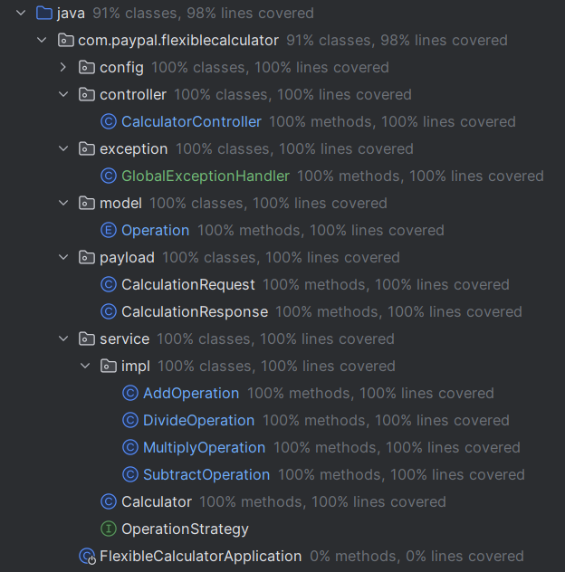

# Flexible Calculator

## Overview

The Flexible Calculator is a Java-based, Spring Boot-powered application that provides a simple, extensible, and RESTful API for performing basic arithmetic operations. The calculator supports operations such as addition, subtraction, multiplication, and division. It also allows for chaining multiple operations together.

## Environment

- **Programming Language**: Java 17
- **Build Tool**: Maven 3.9.6

## Features

- **Basic Operations**: Supports addition, subtraction, multiplication, and division.
- **Chaining Operations**: Users can chain multiple operations in a single request.
- **RESTful API**: The calculator functionalities are exposed through a REST API.
- **Extensibility**: New operations can be easily added without modifying the existing code.
- **IoC Compatibility**: The application is designed to be compatible with Inversion of Control (IoC) principles, allowing for easy dependency injection and testing.

## Design principles 

### 1. **Open-Closed Principle (OCP)**

The Open-Closed Principle states that software entities  should be open for extension but closed for modification. 

**How OCP is Satisfied:**

- **OperationStrategy Interface and Strategy Pattern:** The `OperationStrategy` interface is designed to allow new operations to be added by simply creating new classes that implement this interface (e.g., `AddOperation`, `SubtractOperation`, `MultiplyOperation`, `DivideOperation`). 
- **Extensibility:** To add a new operation, such as modulo or exponentiation, we just need to create a new class implementing the `OperationStrategy` interface. The existing code in the `Calculator` class remains unchanged, fulfilling the Open-Closed Principle.

### 2. **Maintainability**

Maintainability refers to how easily software can be understood, corrected, adapted, and enhanced.

**How Maintainability is Satisfied:**

- **Modular Design:** The separation of concerns between different components ensures that each class has a clear responsibility. This modular design makes the code easier to maintain.
- **Clear and Consistent Structure:** The project is organized in a clear and consistent structure, with logical separation between the model, service, and controller layers.
- **Test Coverage:** Comprehensive unit tests help ensure that changes made to the codebase do not introduce regressions.

### 3. **Extensibility**

Extensibility refers to the ability of the software to be extended with new functionality without major modifications to the existing code.

**How Extensibility is Satisfied:**

- **Adding New Operations:** As mentioned under OCP, new operations can be added by simply creating new classes that implement the `OperationStrategy` interface. The `Calculator` class doesn’t need to be modified to support new operations, which makes it highly extensible.
- **Configuration Flexibility:** With the use of Spring's IoC container, dependencies can be injected and managed externally, which means different implementations can be swapped or added without changing the core logic of the `Calculator` class.

## Installation and Setup

**Clone the Repository**

```bash
git clone https://github.com/1109122780/flexibleCalculatorv1.git

cd flexibleCalculatorv1
```

**Build the Project**

```bash
mvn clean install
```

**Run the Application**

```bash
mvn spring-boot
```

**Access the API**

The API will be available at `http://localhost:8080/api/v1/calculator`.

## API Endpoints

### 1. **Single Operation**

**POST** `/api/v1/calculator/calculate`

**Request Body:**

```json
{ "operation": "ADD", "num1": 5, "num2": 3 }
```

**Response:**

```json
{ "result": 8.0 }
```


### 2. **Chaining Operations**

**POST** `/api/v1/calculator/chain`

**Request Body:**

```json
[ {"operation": "ADD", "num1": 5, "num2": 0}, {"operation": "MULTIPLY", "num1": null, "num2": 2} ]
```

**Response:**

```json
{ "result": 10.0 }
```


## Assumptions

- **Initial Value for Chaining**: When chaining operations, the first operation’s `num1` is used as the initial value. For subsequent operations, `num1` can be `null`, in which case the result of the previous operation is used as `num1`.\- 
- **Invalid Input Handling**: If there is a format issue in the input, such as an incorrect operation or a string input in a `num` field, the API will return an "Invalid Input" message with a `400 Bad Request` status.  - If the numeric input (`num1` or `num2`) or the operation is empty, the API will return an "Illegal Argument" message. - 
- **Chained Operations with Non-null `num1`**: When performing chained operations, if `num1` is provided and is not `null` for a subsequent operation, the calculation resets and starts using this new `num1` value for the operation sequence.

## Testing

- **Unit Tests**: The project includes unit tests to verify the correctness of individual operations and chaining functionality.
  
## Test Cases

### 1. **Basic Addition Operation**

```bash
curl -X POST http://localhost:8080/api/v1/calculator/calculate \
-H "Content-Type: application/json" \
-d '{"operation": "ADD", "num1": 5, "num2": 3}'
```

### 2. **Basic Subtraction Operation**

```bash
curl -X POST http://localhost:8080/api/v1/calculator/calculate \
-H "Content-Type: application/json" \
-d '{"operation": "SUBTRACT", "num1": 10, "num2": 4}'
```

### 3. **Basic Multiplication Operation**

```bash
curl -X POST http://localhost:8080/api/v1/calculator/calculate \
-H "Content-Type: application/json" \
-d '{"operation": "MULTIPLY", "num1": 7, "num2": 6}'
```

### 4. **Basic Division Operation**

```bash
curl -X POST http://localhost:8080/api/v1/calculator/calculate \
-H "Content-Type: application/json" \
-d '{"operation": "DIVIDE", "num1": 20, "num2": 4}'
```

### 5. **Division by Zero (Edge Case)**

```bash
curl -X POST http://localhost:8080/api/v1/calculator/calculate \
-H "Content-Type: application/json" \
-d '{"operation": "DIVIDE", "num1": 20, "num2": 0}'
```

### 6. **Invalid Operation (Edge Case)**

```bash
curl -X POST http://localhost:8080/api/v1/calculator/calculate \
-H "Content-Type: application/json" \
-d '{"operation": "INVALID_OP", "num1": 5, "num2": 3}'
```

### 7. **Null Operand (Edge Case)**

```bash
curl -X POST http://localhost:8080/api/v1/calculator/calculate \
-H "Content-Type: application/json" \
-d '{"operation": "ADD", "num1": null, "num2": 3}'
```

### 8. **Invalid Number Format (Edge Case)**

```bash
curl -X POST http://localhost:8080/api/v1/calculator/calculate \
-H "Content-Type: application/json" \
-d '{"operation": "SUBTRACT", "num1": "not_a_number", "num2": 3}'
```

### 9. **Chained Operations**

```bash
curl -X POST http://localhost:8080/api/v1/calculator/chain \
-H "Content-Type: application/json" \
-d '[{"operation": "ADD", "num1": 5, "num2": 3}, {"operation": "MULTIPLY", "num1": null, "num2": 2}, {"operation": "DIVIDE", "num1": null, "num2": 4}]'
```

### 10. **Chained Operations with an Invalid Operation**

```bash
curl -X POST http://localhost:8080/api/v1/calculator/chain \
-H "Content-Type: application/json" \
-d '[{"operation": "ADD", "num1": 5, "num2": 3}, {"operation": "INVALID_OP", "num1": null, "num2": 2}, {"operation": "DIVIDE", "num1": null, "num2": 4}]'
```

### 11. **Chained Operations with Division by Zero (Edge Case)**

```bash
curl -X POST http://localhost:8080/api/v1/calculator/chain \
-H "Content-Type: application/json" \
-d '[{"operation": "ADD", "num1": 10, "num2": 5}, {"operation": "DIVIDE", "num1": null, "num2": 0}]'
```

### 12. **Chained Operations with Null Operand**

```bash
curl -X POST http://localhost:8080/api/v1/calculator/chain \
-H "Content-Type: application/json" \
-d '[{"operation": "MULTIPLY", "num1": 5, "num2": 2}, {"operation": "SUBTRACT", "num1": null, "num2": null}]'
```

### 13. **Large Number Addition (Edge Case)**

```bash
curl -X POST http://localhost:8080/api/v1/calculator/calculate \
-H "Content-Type: application/json" \
-d '{"operation": "ADD", "num1": 999999999999999999999999999999999999, "num2": 1}'
```

### 14. **Negative Number Multiplication**

```bash
bash复制代码curl -X POST http://localhost:8080/api/v1/calculator/calculate \
-H "Content-Type: application/json" \
-d '{"operation": "MULTIPLY", "num1": -5, "num2": 3}'
```

### 15. **Floating Point Division**

```bash
curl -X POST http://localhost:8080/api/v1/calculator/calculate \
-H "Content-Type: application/json" \
-d '{"operation": "DIVIDE", "num1": 7.5, "num2": 2.5}'
```

### 16. **Complex Chained Operations**

```bash
curl -X POST http://localhost:8080/api/v1/calculator/chain \
-H "Content-Type: application/json" \
-d '[{"operation": "ADD", "num1": 10, "num2": 5}, {"operation": "SUBTRACT", "num1": null, "num2": 3}, {"operation": "MULTIPLY", "num1": null, "num2": 4}, {"operation": "DIVIDE", "num1": null, "num2": 2}]'
```

